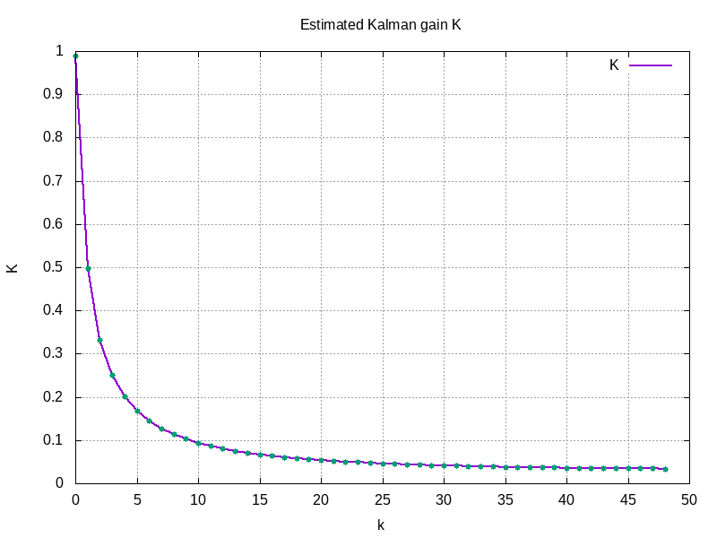

This repo contains just a [C++ implementation](kalman_filter.cpp) of the example on p.13ff. from the following paper:

> [Welch & Bishop - An Introduction to the Kalman Filter](https://www.cs.unc.edu/~welch/media/pdf/kalman_intro.pdf)

Plots generated with [gnuplot](http://www.gnuplot.info).
